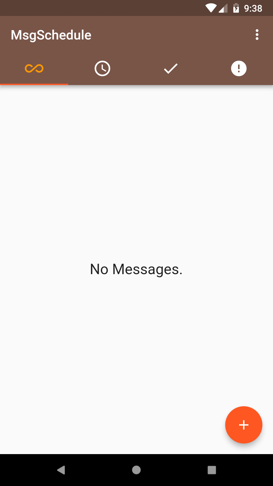
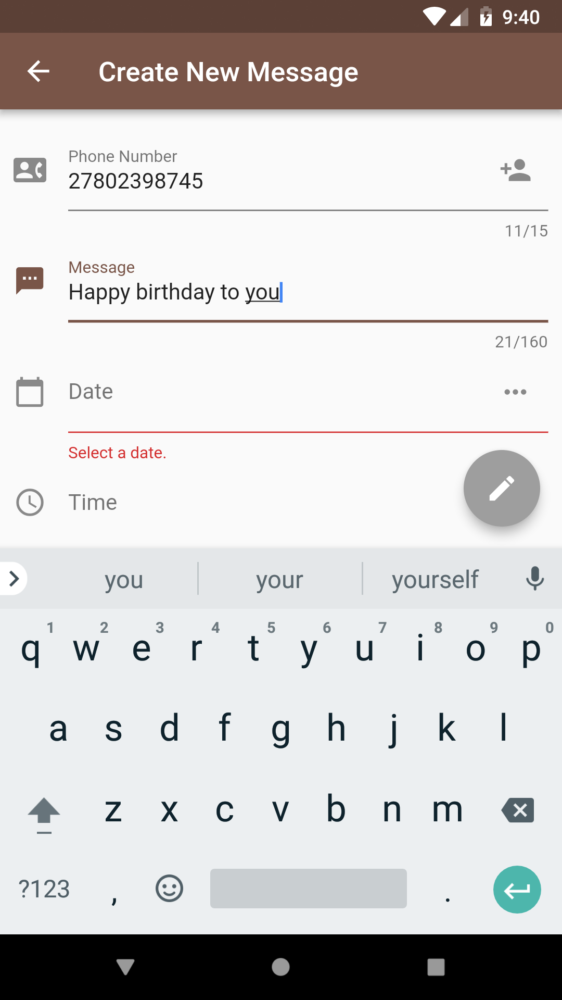
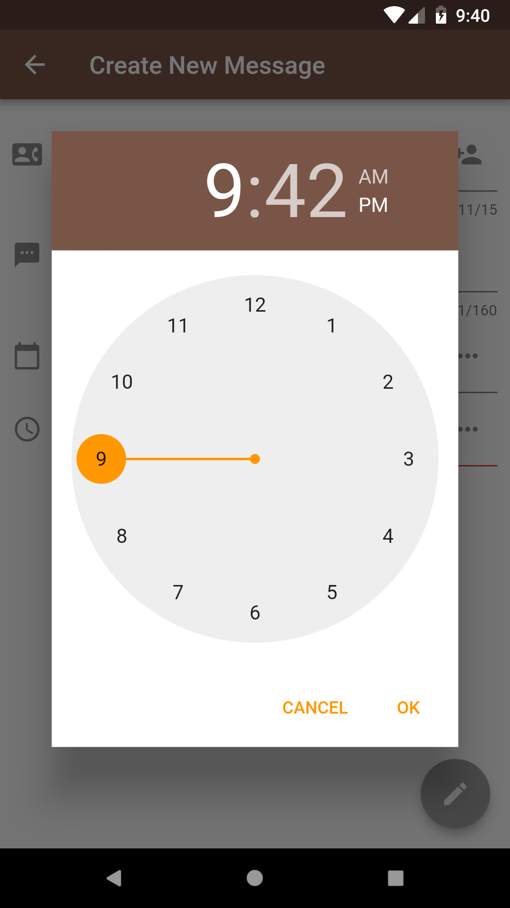
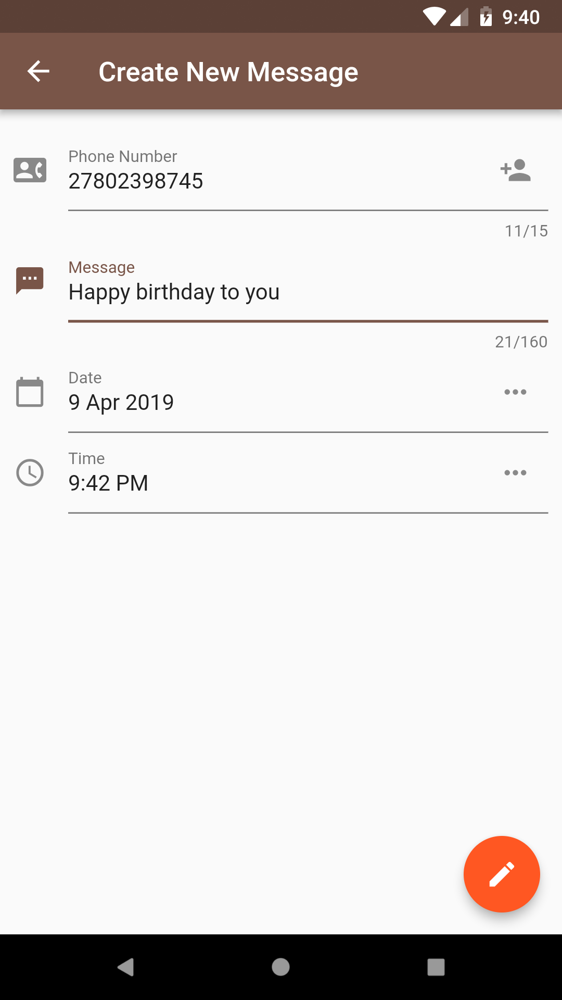
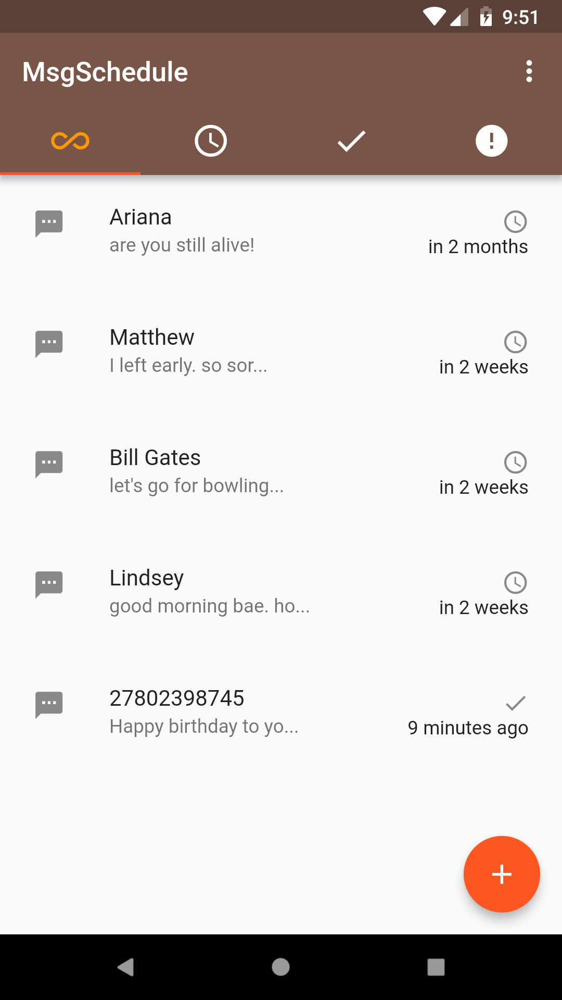
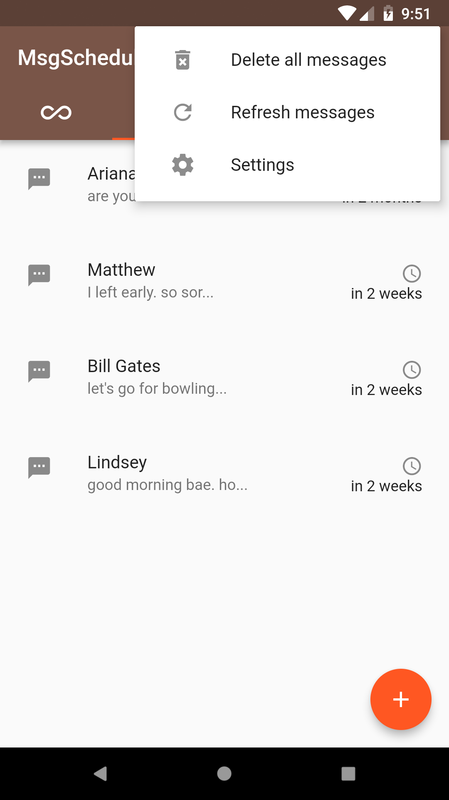
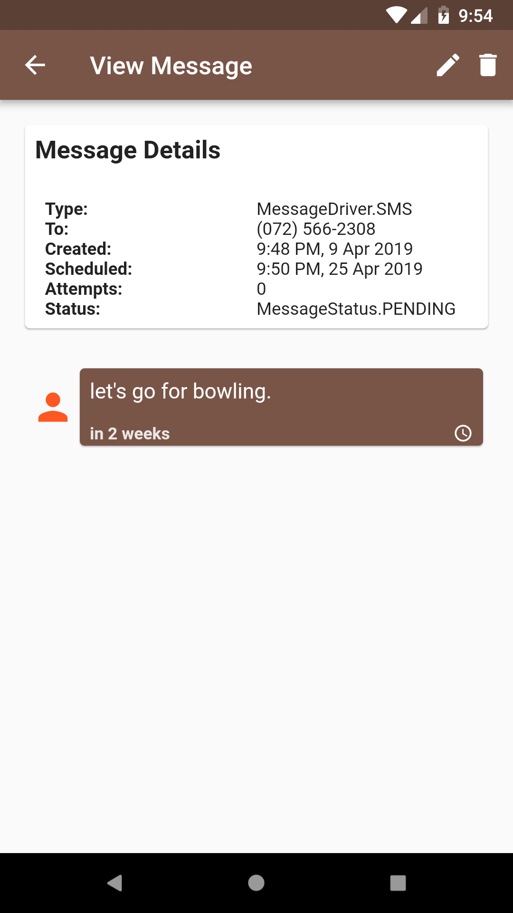
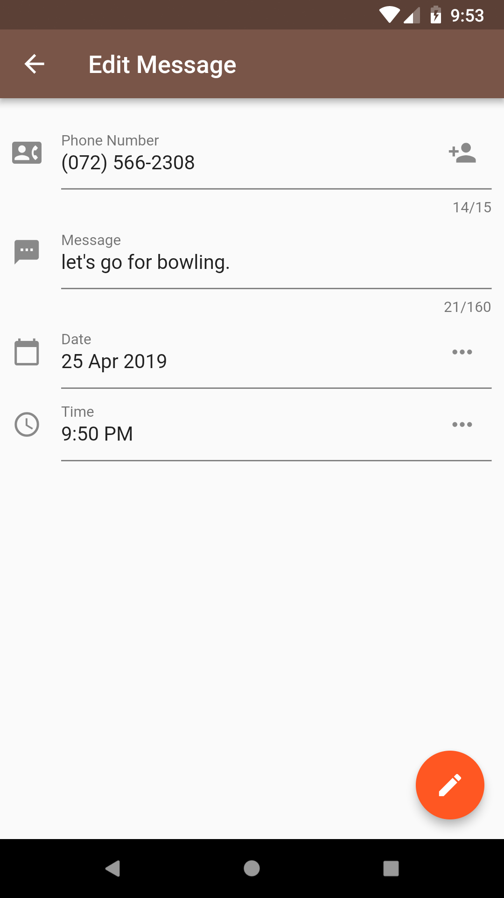
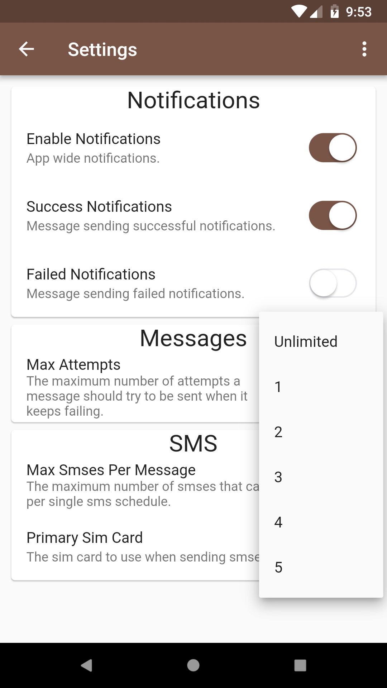

# MsgSchedule

## A flutter app that schedules messages to be sent at a later time. For now the app only schedules SMS messages.

## Features

- Simple intuitive Tabbed UI for:
  1. All Messages.
  2. Pending Messages.
  3. Sent Messages.
  4. Failed Messages.

- Create an SMS message to be sent at a later time.

- Edit scheduled messages.

- Delete schedule messages.

- App is customizable, it has a dedicated Settings Page, for customizing app settings.

- Stores app settings using a lightweight storage system, [Shared preferences](https://github.com/flutter/plugins).

- Pick a contact/name from the device.

- Maps scheduled message number to device contacts/names.

- Periodically retry sending failed scheduled messages.

- Stores scheduled messages offline using [sqflite](https://github.com/tekartik/sqflite).

- Used [Google](https://google.com)'s BLOC architecture pattern.

## Screenshots

### Empty Message Schedule
 

### Create Message
 
 
 

### Filled Schedule
 
 

### View Message
 

### Edit Message
 

### Settings
 

## Building and Running

`> flutter packages get && flutter run`

## Todo

- Process the message schedule when app is running in the background.

- Implement local notifications.

- Enable archiving of messages by swiping left or right.

- What's on your mind???

## Contributions
 Feel free to fork, clone and share the project. To learn how to contribute to this project, please read [CONTRIBUTING.md](contributing.md).

## Questions

I try staying away from social media as much as possible. Hit me up on my personal email <kagisomarvin@gmail.com>. Need I mention, NO SPAM!!!

## License

Copyright (c) 2019 Marvin Kagiso <kagisomarvin@gmail.com>

Permission is hereby granted, free of charge, to any person obtaining a copy
of this software and associated documentation files (the "Software"), to deal
in the Software without restriction, including without limitation the rights
to use, copy, modify, merge, publish, distribute, sublicense, and/or sell
copies of the Software, and to permit persons to whom the Software is
furnished to do so, subject to the following conditions:

The above copyright notice and this permission notice shall be included in all
copies or substantial portions of the Software.

THE SOFTWARE IS PROVIDED "AS IS", WITHOUT WARRANTY OF ANY KIND, EXPRESS OR
IMPLIED, INCLUDING BUT NOT LIMITED TO THE WARRANTIES OF MERCHANTABILITY,
FITNESS FOR A PARTICULAR PURPOSE AND NONINFRINGEMENT. IN NO EVENT SHALL THE
AUTHORS OR COPYRIGHT HOLDERS BE LIABLE FOR ANY CLAIM, DAMAGES OR OTHER
LIABILITY, WHETHER IN AN ACTION OF CONTRACT, TORT OR OTHERWISE, ARISING FROM,
OUT OF OR IN CONNECTION WITH THE SOFTWARE OR THE USE OR OTHER DEALINGS IN THE
SOFTWARE.
